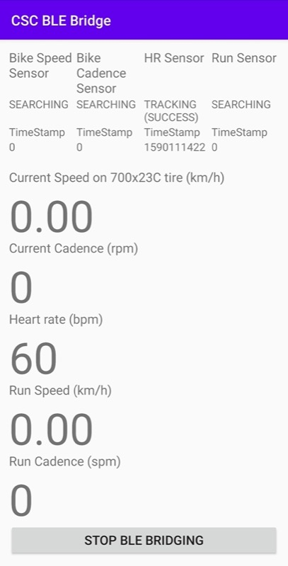

# What

This is an Ant+ to BLE (Bluetooth Low Energy) Bridging app for ANT+ Cycling Speed and Cadence (CSC) sensors, ANT+ heart rate sensors, and ANT+ Stride based speed and distance sensors.
The app will act as a Cycling speed/cadence and/or HR BLE sensor and/or BLE Running speed/cadence so other BLE device (phone, PC, Mac, tablet) can reads data from ANT+ sensors.



# Install

[](https://apt.izzysoft.de/fdroid/index/apk/idv.markkuo.cscblebridge)

Or you can download the apk in [release](https://github.com/starryalley/CSC_BLE_Bridge/releases) and use `adb` to install:

```adb install -r /path/to/app-release.apk```

# Details

This is an Android app which reads ANT+ cycling speed/cadence (CSC), heart rate sensors, and/or stride based speed and distance (SDM) sensors in the background (actually in an Android foreground service), and advertises itself as a `Bluetooth Low Energy (BLE)` device which implements `Cycling Speed and Cadence Profile (CSCP)`, `Heart Rate Profile (HRP)`, and/or `Running Speed and Cadence (rsc)` so that other devices can see this Android device as a Cycling Speed & Cadence Bluetooth, Heart Rate BLE sensor and/or Running foot pod sensor.

This is useful when you only have ANT+ CSC/HR sensors but you want to connect to them as BLE sensors (provided that you don't have an USB ANT+ stick around but happen to have an ANT+ enabled Android device like a Samsung phone).

Long hold on the sensors name on top of the screen to rescan for Ant+ devices after the "Start BLE bridging" button has been pressed. All sensors will automatically scan for Ant+ sources when the "Start BLE bridging" button is pressed.

# Why

I want to try out Zwift desktop version but I can't get a USB ANT+ Stick anywhere now in my country (due to the C-19 pandemic). So I decided to write one.

I can now sees my speed and cadence coming from ANT+ sensors on Zwift Mac without the need of extra hardware.

Special thanks to [pinkemma](https://github.com/pinkemma) who implements Heart Rate sensor profile so that this app also reads heart rate from ANT+ sensor and bridges it to bluetooth. (see [PR #5](https://github.com/starryalley/CSC_BLE_Bridge/pull/5) since 10/2020)

# Tested devices

## ANT+ and BLE enabled Android devices
- Samsung Galaxy S8 (Android 9)
- Samsung Galaxy J5 2016 - Thanks [louisJ20](https://github.com/louisJ20)
- Samsung Galaxy S9 (Android 10) - Thanks [pinkemma](https://github.com/pinkemma)
- One Plus 7 Pro (Android 10) - Thanks [michaelrhughes](https://github.com/michaelrhughes)
- Nokia 7 Plus (Android 10) - Thanks [leaskovski](https://github.com/leaskovski)
- Nexus 5 (CyanogenMod 13 and Ant+ Enabler) - Thanks [leaskovski](https://github.com/leaskovski)
- OnePlus 5T (Android 10) - Thanks [philharle](https://github.com/philharle)
- Galaxy Note 9 - Thanks [larryb84](https://github.com/larryb84)

## ANT+ Speed/Cadence sensors
- [Garmin gen 1 ANT+ only speed and cadence sensor](https://buy.garmin.com/en-MW/ssa/p/146897)
- [Garmin speed cadence combined sensor](https://www.thisisant.com/directory/gsc-10-speed-cadence-bike-sensor) - Thanks [louisJ20](https://github.com/louisJ20)

## ANT+ Heart Rate sensors
- [Garmin HRM-Run](https://buy.garmin.com/en-AU/AU/p/530376)
- Garmin HRM3-SS - Thanks [philharle](https://github.com/philharle)
- Garmin Fenix 5s with broadcasting mode on (ANT+ signal) - Thanks [pinkemma](https://github.com/pinkemma)
- Garmin 935 with broadcasting mode on (ANT+ signal)
- Garmin Fenix 6 with broadcasting mode on (ANT+ signal) 
- Garmin HRM2 - Thanks [larryb84](https://github.com/larryb84)

## ANT+ Stride-based Speed and Distance Monitor (SDM) sensors
- Garmin Foot Pod

## Apps that use BLE sensors
- Zwift (Mac/iPad/Windows version)
- The Sufferfest (Mac version)
- Zwift (iPad Pro)
- theoretically all other apps that use Bike Speed/Cadence or Heart Rate or Run Speed/Cadence BLE sensors


# Known issues

- On my Samsung S8 sometimes the bluetooth PHY is messed up (for unknown reason). I have to reboot the phone to get it working. (When it doesn't work, the advertising reports success but actually you can't see any).

# Reference

Code samples:
- [Bluetooth GATT Server Sample](https://github.com/androidthings/sample-bluetooth-le-gattserver)
- [Android ANT+ SDK sample](https://www.thisisant.com/resources/android-ant-sdk/)

Spec and Document
- [ANT+ Basic](https://www.thisisant.com/developer/ant/ant-basics)
- [Introduction to Bluetooth low energy](https://learn.adafruit.com/introduction-to-bluetooth-low-energy/gatt)
- [CH4 of Getting Started with Bluetooth Low Energy](https://www.oreilly.com/library/view/getting-started-with/9781491900550/ch04.html)
- [Bluetooth GATT Specifications](https://www.bluetooth.com/specifications/gatt)
  - Cycling Speed and Cadence Profile/Service
  - Heart Rate Profile/Service
  - [Bluetooth Assigned numbers](https://www.bluetooth.com/specifications/assigned-numbers/service-discovery/)
