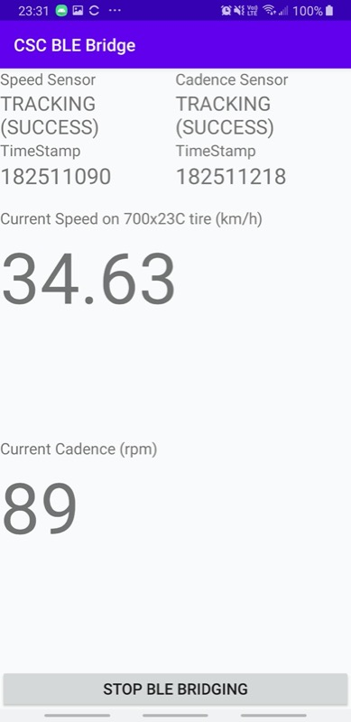

# What

This is an Ant+ to BLE (Bluetooth Low Energy) Bridging app for ANT+ Cycling Speed and Cadence (CSC) sensors. 
The app will acts as a Cycling speed/cadence BLE sensor so other BLE device (phone, PC, Mac, tablet) can reads data from ANT+ sensors.

## Details

This is an Android app which reads ANT+ cycling speed/cadence (CSC) sensor/sensors in the background (actually in an Android foreground service), and advertises itself as a `Bluetooth Low Energy (BLE)` device which implements `Cycling Speed and Cadence Profile (CSCP)` so that other devices can see this Android device as a Cycling Speed and Cadence Bluetooth BLE sensor.

This is useful when you only have ANT+ CSC sensors but you want to connect to them as BLE sensors (provided that you don't have an USB ANT+ stick around but happen to have an ANT+ enabled Android device like a Samsung S8 that I have).

# Why

I want to try out Zwift desktop version but I can't get a USB ANT+ Stick anywhere now in my country (due to the C-19 pandemic). So I decided to write one.

I can now sees my speed and cadence coming from ANT+ sensors on Zwift Mac without the need of extra hardware.

# Tested devices

## ANT+ and BLE enabled Android devices
- Samsung Galaxy S8
- Samsung Galaxy J5 2016

## ANT+ Speed/Cadence sensors
- [Garmin gen 1 ANT+ only speed and cadence sensor](https://buy.garmin.com/en-MW/ssa/p/146897)

## Apps that use BLE CSCP (Cycling Speed/Cadence profile)
- Zwift Mac version on a 2019 13" macbook pro

# TODO

- only speed sensor and cadence sensor (both features enabled) implemented so far, and I did not take into account that when speed/cadence is a single combined sensor. However, if you only have one of the sensor (either speed or cadence), this should not affect the functionality. On Zwift (or other app which reads CSCP through BLE) you will see only speed or only cadence data.

- only tested with the [Garmin gen 1 ANT+ only speed and cadence sensor](https://buy.garmin.com/en-MW/ssa/p/146897) since it's the only thing I got. For BLE client app, I only tried Zwift Mac version on a 2019 13" macbook pro.

# Known issues

- On my Samsung S8 sometimes the bluetooth PHY is messed up (for unknown reason). I have to reboot the phone to get it working. (When it doesn't work, the advertising reports success but actually you can't see any).

# Reference

Code samples:
- [Bluetooth GATT Server Sample](https://github.com/androidthings/sample-bluetooth-le-gattserver)
- [Android ANT+ SDK sample](https://www.thisisant.com/resources/android-ant-sdk/)

Spec and Document
- [ANT+ Basic](https://www.thisisant.com/developer/ant/ant-basics)
- [Introduction to Bluetooth low energy](https://learn.adafruit.com/introduction-to-bluetooth-low-energy/gatt)
- [Bluetooth GATT Specifications](https://www.bluetooth.com/specifications/gatt)
  - Cycling Speed and Cadence Profile
  - Cycling Speed and Cadence Service
  - [Bluetooth Assigned numbers](https://www.bluetooth.com/specifications/assigned-numbers/service-discovery/)
